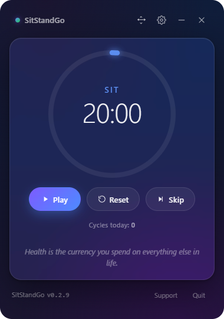
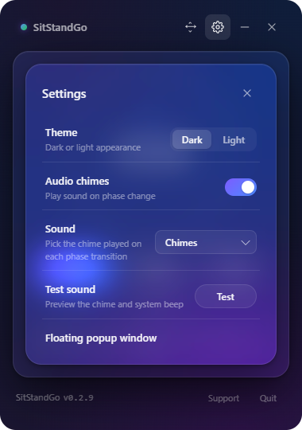
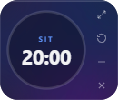
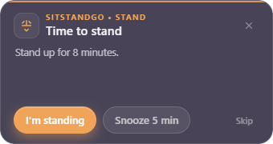

<div align="center">

# 🪑 SitStandGo

### A small Windows app that reminds you when to **sit**, **stand**, and **move**.

**Built for the 20-8-2 standing desk rule:** 20 minutes sitting · 8 minutes standing · 2 minutes moving.

<br/>

[](https://github.com/xenstar/sitstandgo/releases/latest)
[](https://github.com/xenstar/sitstandgo/releases/latest)
[](#license)
[](#privacy)

<br/>

[Why I built this](#why-i-built-this) · [Screenshots](#screenshots) · [20-8-2 Rule](#what-is-the-20-8-2-rule) · [Features](#features) · [Download](#download)

</div>

---

## 💡 Why I built this

Recently I bought a standing desk.

Most of us already understand the concept: sitting all day is not great, standing all day is not the answer either, and moving a little during work is important.

But when it comes to action, there is a simple problem: **there is usually nothing reminding us to actually do it.**

When I was focused on work, my desk just stayed in one position for hours. I would remember the idea later, but not at the moment when I needed to stand or move.

That's why I built **SitStandGo**.

It reminds me when to sit, when to stand, and when to take 2 minutes to move around. Nothing complicated. No account. No dashboard. Just a small desktop app that turns the 20-8-2 idea into a real habit while I work.

---

## 📸 Screenshots

| Full timer | Settings |
|---|---|
|  |  |

| Mini mode | Floating reminder |
|---|---|
|  |  |

---

## 🧠 What is the 20-8-2 rule?

The **20-8-2 rule** is a practical standing desk rhythm often associated with Cornell ergonomics researcher **Dr. Alan Hedge**:

- 🪑 **20 minutes** sitting
- 🧍 **8 minutes** standing
- 🚶 **2 minutes** moving, walking, or stretching

Then repeat.

The exact numbers are not meant to be a medical prescription. The main idea is simple: **do not stay static for too long**. Sitting all day is not good, but standing still all day is not the answer either. The useful part is the cycle: sit, stand, move, repeat.

Cornell's ergonomics guidance puts it clearly:

> "Simply standing is insufficient. Movement is important to get blood circulation through the muscles."
>
> — Alan Hedge, Cornell University Ergonomics Web

Useful references:

- Cornell CUErgo Sit-Stand Working Programs: https://ergo.human.cornell.edu/CUESitStandPrograms.html
- Cornell CUErgo Sitting and Standing: https://ergo.human.cornell.edu/CUESitStand.html
- Hbada 20-8-2 overview: https://hbada.com/blogs/hbada-blogs/what-is-the-20-8-2-rule-everything-you-need-to-know-about-healthier-sitting-and-productive-work

---

## ✅ What SitStandGo does

SitStandGo turns the 20-8-2 idea into a simple desktop reminder.

```text
20 minutes sitting  →  8 minutes standing  →  2 minutes moving  →  repeat
```

When each phase ends, the app reminds you what to do next.

You can confirm, snooze, skip, reset, or switch to the small mini timer if you do not want the full window on screen.

---

## ✨ Features

### ⏱️ Core timer

- 20-8-2 cycle: sit, stand, move, repeat
- Drift-free countdown that stays accurate while minimized
- Daily completed-cycle counter
- Pause, resume, reset, and skip controls

### 🔔 Reminders

- Floating popup reminder
- In-app reminder
- Windows notification fallback
- Snooze option
- Confirm button for each phase
- Audio chimes
- 12 built-in sounds
- Test sound button in settings

### 🖥️ Full mode

- Large circular progress ring
- Current phase and remaining time
- Play / pause, reset, and skip buttons
- Daily cycle count
- Small health quote at the bottom
- Dark and light theme

### 🪟 Mini mode

- Compact timer
- Small circular progress ring
- Expand, reset, minimize, and close buttons
- Adjustable opacity
- Optional always-on-top behavior
- Designed so the buttons stay clickable on Windows frameless windows


### 🔒 Privacy

- No account
- No analytics
- No telemetry
- No cloud sync
- Settings are stored locally on your computer

---

## ⬇️ Download

Download the latest Windows build here:

**https://github.com/xenstar/sitstandgo/releases/latest**

> Note: the app is currently unsigned, so Windows SmartScreen may show a warning on first launch.

---

## 📄 License

MIT


